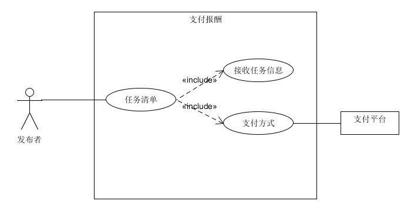
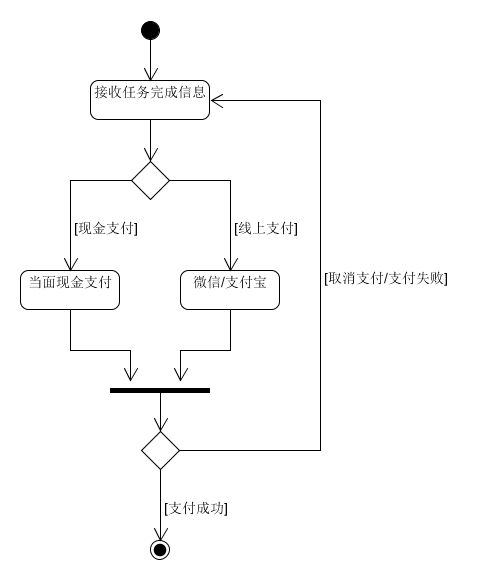
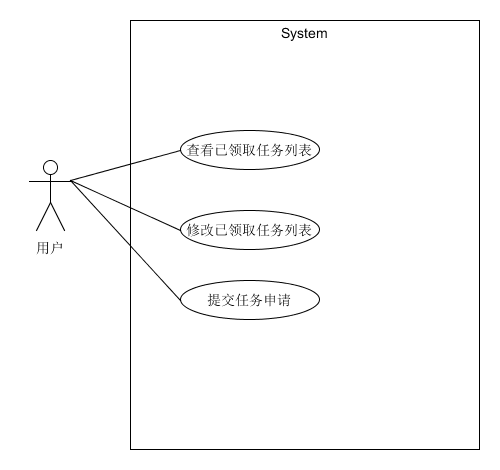
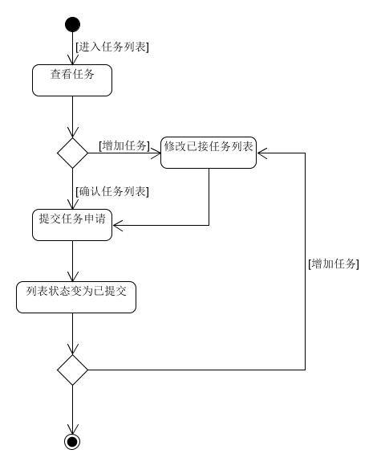

# Use cases



# 详述用例  
## Use case 1 用户接取任务  
**范围** ：闲钱快应用  
**级别** ：用户目标  
**主要参与者** ：用户  
**涉众及关注点**：  

- 用户： 希望便捷、清晰地看到任务发布者的所有任务。希望便捷、清晰地看到列表内的可接取任务。（同一桌上的不同顾客可以同时对本桌的菜单进行编辑。）可以看到当前接取任务的总报酬金额。
- 管理中心：记录每次任务完成后的交易报酬。
- 任务发布者：希望准确地记录交易。希望确保记录了用户接取了任务的凭据。希望有一定的容错性，即使在某些服务器构件不可用时（如微信支付），也能够支付报酬。希望能够自动、快速地更新任务的进度。
- 支付授权服务：希望接受到格式和协议正确的数字授权请求。希望准确计算对用户的应付报酬。

**前置条件** ：用户必须满足某些任务的需求条件。顾客必须通过微信等实名认证的账户登录认证。  
**成功保证（后置条件）** ：存储任务信息。准确计算报酬。更新任务进度。记录支付授权的批准。  
**主成功场景（或基本流程）** ：
1. 用户通过账户登录进入本应用。
2. 用户通过浏览任务清单了解当前可接取的任务或者可填写的问卷。
3. 用户选择各自想接取的任务，添加进预申请界面。
4. 用户可以在预申请界面中查看当前已接取任务的个数和总共报酬。
5. 用户确认预订单后，被接取的任务冻结，其他用户不能再该任务，任务发布者收到任务被接取的信息。
6. 用户完成任务后，与任务发布者协商领取报酬的方式。
7. 若选择领取方式为现金，则可以与任务发布者联系商量线下支付的事宜。
8. 若选择领取方式为在线，则直接在程序内领取。
9. 系统生成交易票据。  

**扩展（或替代流程）**：
- 用户在接取任务过程的任意时段意外退出小程序：
  - 系统保存当前用户预接取的任务状态。
  - 用户重新进入系统后，系统恢复用户退出之前的界面信息。
 
- 用户选择任务的时候恰好被其他用户抢先接取了。
  - 跳出弹窗告知该任务已被接取并表示歉意。
- 系统友情提醒再次确认任务清单无误。
  - 原则上可接受任务中途放弃任务，但需要支付违约金，在确认任务清单前弹窗提醒帮助用户合理选择。
- 现金支付
  - 用户输入收取的现金额
  - 任务发布者支付报酬
  - 系统记录该现金支付
- 支付宝支付
  - 用户提供自己的支付宝/微信二维码付款码
  - 任务发布者打开支付宝扫一扫进行扫码付款
  - 管理中心确认收款金额并确认任务完成，系统记录该在线支付  
  
**特殊需求**： 

- 支持文本显示的语言国际化  
- 可以支持微信、支付宝、现金付款。  
  - 发生频率 ：可能会不断地发生。  

**未决问题** ：
- 研究远程服务的恢复问题  
- 不同用户获取当前任务列表的时候，如何保证数据一致性问题  
- 用户接取任务后不及时完成任务等    

# 非正式用例
## Use Case 2.1 任务发布者支付报酬
**主成功场景**：用户完成任务后，进入任务完成界面，点击完成，系统提示是否确认提交任务，用户点击确定后，系统提示选择领取报酬方式，用户选择微信并成功领取，任务状态自动更新为已完成，任务列表被清空。  
**交替场景**：  
•	用户点击完成后发现不够完善，点击取消返回任务信息界面。  
•	用户选择领取方式为现金支付，与发布者协商并领取后，管理中心收到信息后手动更新任务状态为已完成。  
•	如果系统检测到与支付平台通信失败，用户无法领取，跳转回任务页面用户重新选择支付。  
**用例图**：  
  
**活动图**：  

## Use case 2.2 用户接取任务
**主成功场景**：用户选择任务完毕后，询问用户是否选择完毕，点击提交申请，确认并提交申请，任务信息上显示正在进行  
**交替场景**：  
•	用户需要增加新任务，在主菜单界面添加新任务后，返回任务清单，发现已提交状态变为提交申请，并留意到tips写着不会重复申请，用户确认新列表后提交新任务申请，申请状态重新变为已提交。  
•	用户提交申请后，选择领取报酬方式。    
**用例图**：  
  
**活动图**:  

**简述用例**
## Use case 3.1 查看紧急任务
•	**Actor**：用户  
•	**Type**：Primary  
•	**Description**：用户进入小程序，切换到紧急任务的界面，浏览自己感兴趣的任务，并点击进入任务查看相关的任务信息，选择自己喜欢任务。  
## Use Case 3.2 发布任务
•	**Actor**：任务发布者  
•	**Type**：Primary  
•	**Description**：发布者有了新需求，需要帮助， 于是进入管理界面，提供任务的相关信息，设置任务时限， 并点击确定，在任务列表看到该任务后，打开小程序，在主菜单页面也能看到任务，上传成功。  
## Use Case 3.3 调查问卷
•	**Actor**：管理中心  
•	**Type**：Primary  
•	**Description**：管理中心的管理员想通过发布调查问卷的方式，来了解用户的感想或对任务发布者的评价，填写问卷也会有相应的报酬可领取。

